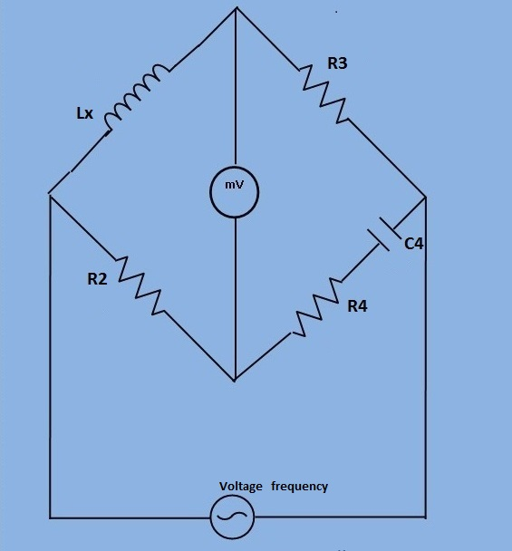

## Objective
- To determine the self inductance of a high quality factor unknown coil.
- The Hay's bridge is a modification of Maxwell's bridge. The connection diagram is shown in figure 1. This bridge uses a resistance in series with the standard capacitor (unlike the Maxwell bridge which uses a resistance in parallel with capacitor).
- 
- 
***Fig 1: Circuit diagram for measurement of self inductance of high quality factor coil by Hay's bridge***
Let,
     `L_1`= Unknown inductance having resistance `R_1`.
     `R_2`, `R_3`, `R_4`= known non inductive resistance.
     `C_4` = Standard capacitor.

At Balance,
`(R_1+j*omega*L_1)*(R_4 - j/(omega*C_4) )=R_2*R_3 `

` R_1*R_4+ L_1/C_4 +j*omega*L_1*R_4 - j*R_1/(omega*C_4) = R_2*R_3 `

separating the real and imaginary terms, we get

`R_1R_4 + L_1/C_4 = R_2R_3 . . . . . . . . . (1)`
`j*omega*L_1R_4 - (jR_1)/(omegaC_4) = 0 . . . . . . (2)`

Solving the above two equations(1) and (2), we have,

`L_1 = (R_2R_3C_4)/(1 + omega^2 C_4^2 R_4^2)`

`R_1 = (omega^2C_4^2R_4R_2R_3)/(1 + omega^2C_4^2R_4^2)`

The Quality factor of the coil `Q = (omegaL_1)/R_1 = 1/(omegaC_4R_4)`.
