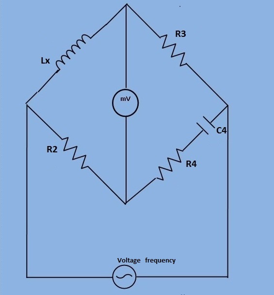

# Introduction

## Objective
- To determine the self inductance of a high quality factor unknown coil.
- The Hay's bridge is a modification of Maxwell's bridge. The connection diagram is shown in figure 1. This bridge uses a resistance in series with the standard capacitor (unlike the Maxwell bridge which uses a resistance in parallel with capacitor).

### Circuit Diagram

***Fig 1: Circuit diagram for measurement of self inductance of high quality factor coil by Hay's bridge***

Let,
     L1= Unknown inductance having resistance R1.  
     R2, R3, R4= known non inductive resistance.  
     C4 = Standard capacitor.

At Balance,

$$ (R_1+j*\omega * L_1)*(R_4 - \frac{j}{\omega * C_4 })=R_2*R_3 $$

$$ R_1*R_4+ \frac{L_1}{C_4} +j*\omega * L_1*R_4 - j*\frac{R_1}{(\omega * C_4) }= R_2*R_3 $$

separating the real and imaginary terms, we get

$$ R_1R_4 + \frac{L_1}{C_4} = R_2R_3 . . . . . . . . . (1) $$

$$ j*\omega*L_1R_4 - \frac{jR_1}{\omega C_4 }= 0 . . . . . . (2) $$

Solving the above two equations(1) and (2), we have,

$$ L_1 =\frac{R_2R_3C_4}{1 + \omega^2 C_4^2 R_4^2} $$

$$ R_1 = \frac{\omega^2C_4^2R_4R_2R_3}{1 + \omega^2C_4^2R_4^2} $$

The Quality factor of the coil

$$ Q = \frac{\omega L_1}{R_1} = \frac{1}{\omega C_4R_4} $$

